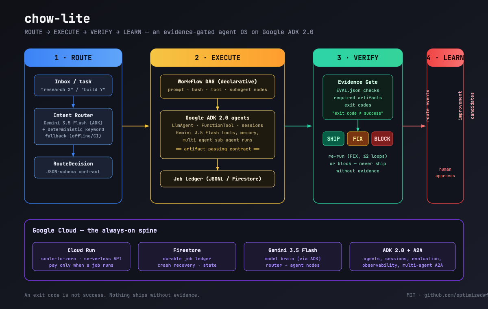

# nine
<p align="center">
  
  
  
  
</p>


**A router-first, evidence-gated agent operating system.**
Tasks come in → the router picks the right workflow → the workflow runs →
the evidence gate refuses to say "done" without proof. Nothing ships until
it's done **to the nines**.

*Model-agnostic by design: defaults to the latest Gemini Flash, works with
any provider through Google ADK's model registry. `GEMINI_MODEL` drives the
raw-client nodes (router, responder, summarizer) — the ADK workflow nodes
are pinned to `gemini-3.6-flash` unless `NINE_LLM_BACKEND=openai` routes
every model node to an OpenAI-compatible tunnel (`NINE_LLM_MODEL` picks the
tunnel model, default `deepseek-v4-flash`). See the LLM provider switch
section below.*

```
  ROUTE → EXECUTE → VERIFY → LEARN
```

> "An exit code is not success. A receipt is UNVERIFIED until the expected
> artifact and validation produce an evidence-backed SHIP/FIX/BLOCK."

nine is the open-source, lightweight version of the agent harness that
runs our own multi-lane agent operation. It is built **on Google ADK 2.0 +
Gemini 3.6 Flash (default) + Cloud Run + Firestore** — no vendor lock-in, MIT licensed,
self-hostable, scale-to-zero.

---

## Architecture



**One loop, four phases, zero blind trust:**

| Phase | What happens | Backing tech |
|---|---|---|
| **ROUTE** | every task is classified to a workflow (intent router) | Gemini 3.6 Flash via ADK + KeywordRouter substrate (routing only — output is always model-generated) |
| **EXECUTE** | declarative workflow DAGs run typed nodes (`prompt`/`bash`/`tool`/`subagent`) | Google ADK 2.0 agents, artifact-passing contract |
| **VERIFY** | evidence gate checks EVAL.json, required artifacts, exit codes | verdict: **SHIP / FIX / BLOCK** |
| **LEARN** | route events -> improvement candidates (human-approved only) | append-only event store, never auto-applies |

Multi-hop **chains** hand off artifacts between departments with a gate at
every handoff — nothing ships without evidence, at any stage.

### Semantic context management (Cerebras-inspired)

Between hops, nine never drags raw history forward. Each hop runs with a
**fresh context window** and hands off **files, not conversation** — the
research hop's raw findings are distilled into a bounded `HANDOFF.md`
("minimum viable context", the Cerebras multi-agent lesson), and the plan
hop reads the distilled brief instead of the full document:

```text
research.md ──► summarize node ──► HANDOFF.md ──► plan ──► build ──► review ──► teach
                 (Gemini distill;                        (each hop: fresh context,
                  fails loud without                       files are the interface)
                  a model — never fabricated)
```

Every shipped hop also records its **artifact summaries + lineage** into a
durable **MemoryGraph** (local `jobs/memory.jsonl` by default, Firestore
collection `nine-memory` in the cloud via `NINE_MEMORY=firestore`). Query
it from the CLI:

```bash
$ nine memory search chromodynamics     # distilled summaries that match
$ nine memory list                      # recent hop memories
```

This keeps Firestore documents tiny by design — the graph stores **distilled
summaries and manifests (sha256/size), never raw transcripts or artifact
content** — so a 50-step workflow is 50 small records, far under the 1MB
document limit. Firestore has no full-text search, so `search_context` is a
documented recent-window keyword filter; the adapter contract
(`save_artifact_summary` / `search_context`) lets you swap in a real
metadata graph — e.g. **DataHub MCP** (`NINE_DATAHUB_MCP=1` adds an optional
`datahub-context` tool node, the "read the graph first" pattern from our
datahub-2026 build) — without touching the core loop.

### The visible LEARN loop


Every submit path (CLI, server, chains, direct answers) appends a **route
event** to `jobs/events.jsonl` — the task, the routed workflow, the router's
confidence, and the verdict. `nine learn scan` turns weak signals into
**improvement candidates**:

```bash
$ nine submit "study quantum chromodynamics"
  -> research  (confidence 0.179)
$ nine learn scan
  cand-…  [keyword]  pending
      route to 'research' at confidence 0.18 (low);
      add keyword 'chromodynamics' or re-describe the workflow
      params: {"workflow_id": "research", "keyword": "chromodynamics", …}
$ nine learn apply cand-…
  # regression suite runs BEFORE and AFTER the catalog change
  # commits nine/router/catalog.json (git-tracked, rollback = git revert)
$ nine submit "chromodynamics of gauge fields"
  -> research  (confidence 0.467)   # 2.6× more confident, same workflow
$ nine learn revert cand-…          # remove the override, re-gated, committed
```

Doctrine: **the loop never changes behavior silently.** Apply/revert are
gated by the full regression suite (green before and after), every change is
a git commit, the human owns the final keyword choice (candidate-only), and
the catalog is the *only* file LEARN writes — base routing logic is never
edited. Server surface: `GET /v1/events` and `/v1/stats` expose the same
event + candidate counts.

## Quickstart

```bash
pip install -e .            # or: uv pip install -e .
export GEMINI_API_KEY=...   # required for any output; routing works without it, execution never does
nine submit "research the history of the typewriter"
nine chain demo "respond to customer refund question"   # 3-hop demo lane
                                                       # (demo lane = canned
                                                       #  boilerplate, by
                                                       #  design: it proves the
                                                       #  pipeline, it is NOT in
                                                       #  production routing)
nine chain flagship "build a calculator"                # 5-hop full chain
nine stats
```

### LLM provider switch (testing)
Default backend is Google Gemini direct (`GEMINI_API_KEY`, model `gemini-3.6-flash`). For TESTING ONLY (e.g. while the Gemini quota is exhausted) set `NINE_LLM_BACKEND=openai` to route the SAME model nodes (ADK LlmAgents, router, responder, summarizer, gemma teach hop) to an OpenAI-compatible tunnel — default `https://opencode.ai/zen/go/v1` with `deepseek-v4-flash`, key from `NINE_LLM_API_KEY` -> `OPENCODE_GO_API_KEY` -> `~/.agent-vault/keys/opencode-go.key` -> `~/.prime/agent/auth.json` `opencode-go`. Model-or-fail is preserved on both backends: no key/API failure degrades to fabricated output — callers raise `WorkflowError`.


Everything ships with a full artifact trail and a SHIP/FIX/BLOCK verdict per
job — see `nine status <job_id>` and `nine artifacts <job_id>`.

## Submission pack (All Things Agentic 2026)

Devpost-ready description, judging-rubric mapping, demo-video script, and the
3 human-only setup steps: see [SUBMISSION.md](SUBMISSION.md) and
[docs/ADAM-RUNBOOK.md](docs/ADAM-RUNBOOK.md).

## Why this exists

Most "agents" are chatbots in a trench coat: they talk, they don't do.
And the ones that do act usually **claim success without proof** — a script
exits 0 and everyone assumes it worked.

nine makes agents *trustworthy by construction*:

1. **ROUTE** — every task is classified to a workflow by an intent router
   (Gemini 3.6 Flash, with the KeywordRouter substrate when no model is
   configured — routing decides the lane, it never fabricates output).
2. **EXECUTE** — workflows are declarative DAGs of typed nodes
   (`prompt` / `bash` / `tool` / `subagent`), with artifacts passed between
   nodes under a JSON-schema contract.
3. **VERIFY** — an evidence gate runs checks (EVAL.json, required artifacts,
   exit codes) and returns a verdict: **SHIP / FIX / BLOCK**. A job is only
   `shipped` when the evidence passes — everything else is UNVERIFIED.
4. **LEARN** — every route decision and job outcome is logged to a durable
   ledger; workflow stats feed back into better routing. Candidate-only
   self-improvement: nothing promotes until it passes the regression suite.

## Quickstart

```bash
python -m venv .venv && source .venv/bin/activate
pip install -e .

nine submit "research the latest agent frameworks"
# → route decision (workflow_id: research)
# → workflow runs, produces research.md + HANDOFF.md
# → evidence gate: SHIP (all evidence checks passed)
# → job ledger: submitted → routing → running → awaiting_evidence → shipped

nine discover              # list jobs
nine status <job_id>       # full job record + verdicts
nine artifacts <job_id>    # artifact manifest (sha256, size, producer)
nine cancel <job_id>       # cancel
nine recover <job_id>      # recover a blocked/failed job
nine stats                 # ledger stats
```

## Required tech (hackathon rules compliance)

| Requirement | nine uses |
|---|---|
| Gemini 3.5 or newer | Gemini 3.6 Flash via Gemini API (router + agent steps) |
| Google agent framework | **Google ADK 2.0** (agents, routing, workflow-agents, sessions/memory, evaluate, observability) |
| Google Cloud infra service | **Cloud Run** (scale-to-zero deployment) + **Firestore** (durable job ledger, memory, route events) |

## Architecture

```
[Task] → [Router: Gemini 3.6 Flash classification]
              │ route-decision (schema-validated)
              ▼
[Workflow DAG: ADK workflow-agents (sequential/parallel/loop)]
   nodes: prompt | bash | tool | subagent  — artifact passing (schema)
              │
              ▼
[Evidence Gate: ADK evaluate + EVAL.json + exit codes]
   verdict: SHIP | FIX | BLOCK   (exit code ≠ success)
              │
              ▼
[Job Ledger: Firestore/JSONL]  submit→routing→running→awaiting_evidence→shipped
              │
              ▼
[Learn: route events → workflow stats → better routing (candidate-only)]
```

Deployment: `deploy/cloud-run.yaml` (scale-to-zero), Firestore for state,
ADK agents in the user-facing build hop (LlmAgent + FunctionTool) with an
independent bash self-test writing EVAL.json from the real run result.
Secret hygiene by design: redaction in logs, reference-only paths, never
commit credentials.

## Repository layout

```
nine/
  router/classifier.py    intent classifier + route-decision contract
  ledger/ledger.py        durable job ledger (JSONL + Firestore adapters)
  gates/evidence.py       SHIP/FIX/BLOCK evidence gate (EVAL.json, exit codes)
  schema_validation.py    JSON Schema checks at every boundary (jsonschema)
  runtime/workflows.py    declarative workflow DAG executor
  runtime/adk_runtime.py  Google ADK 2.0 integration layer
  cli.py                  operator CLI (submit/status/discover/...)
schemas/                  JSON Schemas: route-decision, agent-job, verdict, artifact
nine/learn/               route-event store + improvement candidates
nine/chains/              chain engine + flagship 5-hop chain + demo lane
nine/workflows/           example workflow DAGs
deploy/                   Cloud Run + Firestore config (FastAPI operator API)
docs/                     architecture diagram (SVG + PNG)
tests/                    601 tests (router, ledger, gates, executor, chains, learn, ADK, doc-truth)
```

## Roadmap

- [x] Core loop (router → workflow → gate → ledger) with 596 passing tests (601 collected, 5 live-gated skips)
- [x] Google ADK 2.0 agent integration (agents as `subagent` nodes)
- [x] 5-hop chain (research → plan → build → review → teach) + demo lane
- [x] Cloud Run + Firestore deploy layer (Dockerfile, service, rules, API)
- [x] Route-event learning loop (append-only JSONL + candidate-only learner)
- [x] Architecture diagram + demo lane + one-command `python demo.py`
- [x] Second Google model: Gemma 4 teach hop (+0.2 Stage-3 bonus, live-tested)
- [ ] Live Cloud Run deployment (needs Adam to auth gcloud — runbook in docs/ADAM-RUNBOOK.md)
- [ ] Demo video with live GCP proof (script in docs/demo-script.md)

## License

MIT © 2026 Adam Norman & Nine
